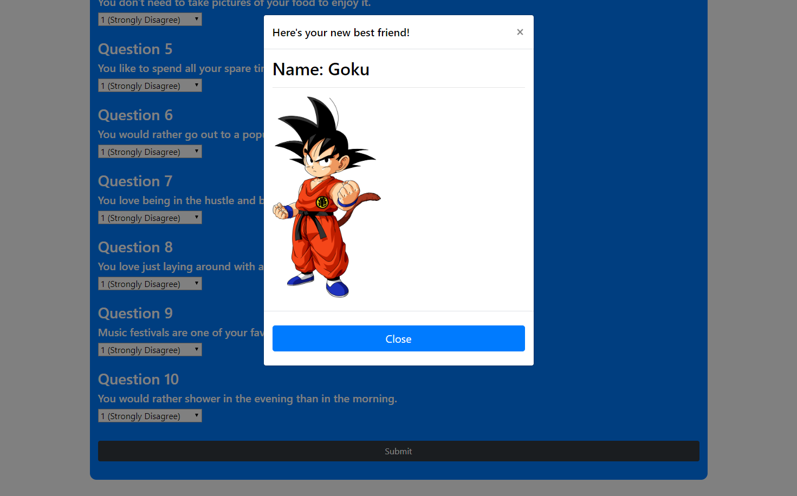
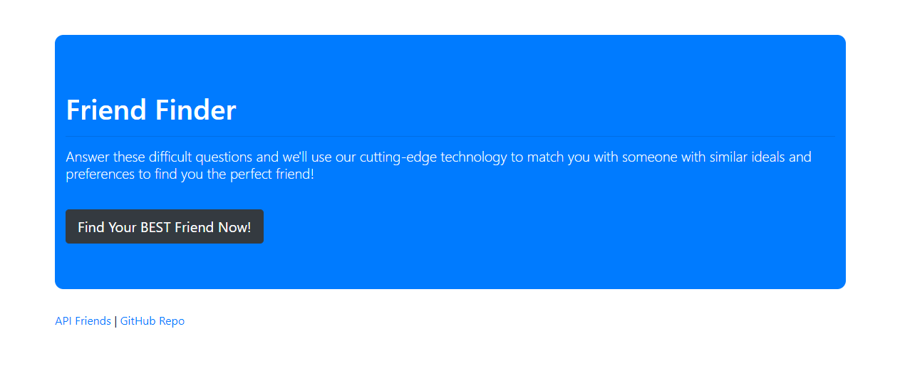

# Friend Finder

Friend Finder is a web-based application that allows the user to be matched with another according to their compatibility scores defined by the answers they choose in the survey questions *(albeit, not very accurately or by any real metrics since I made up the questions myself).*

This application was an assignment I completed for the UC Berkeley Coding Bootcamp as my first attempt at engineering and deploying my first full-stack site. And as such, I utilized both front-end and back-end languages/technologies.

---
## Technologies Used

- [Heroku](https://www.heroku.com/): Cloud Application Platform
- [Node.js](https://nodejs.org/)
    - [Express.js](https://expressjs.com/) Module Framework
- Javascript
    - [jQuery](https://jquery.com) JS Library
- CSS
    - [@Bootstrap](https://getbootstrap.com) CSS Library
- HTML
- Git